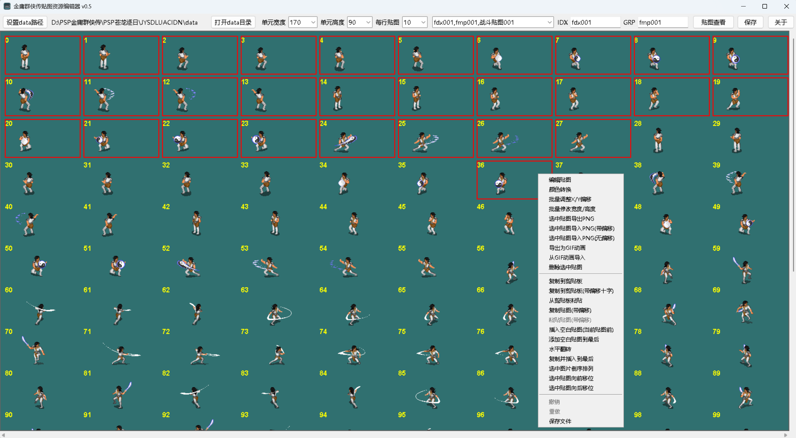
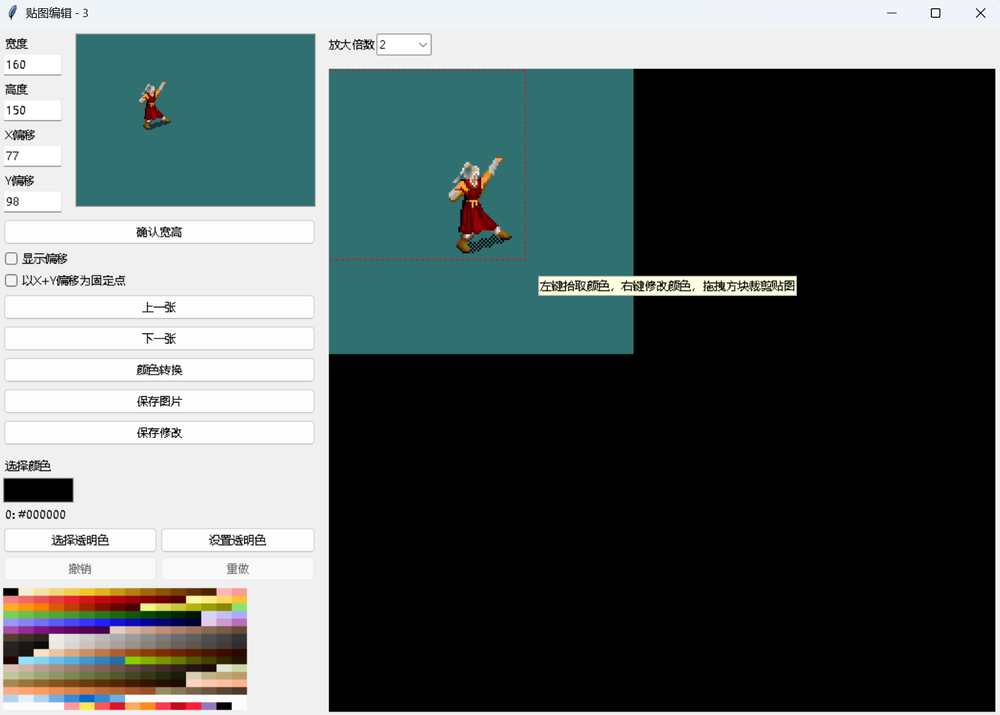
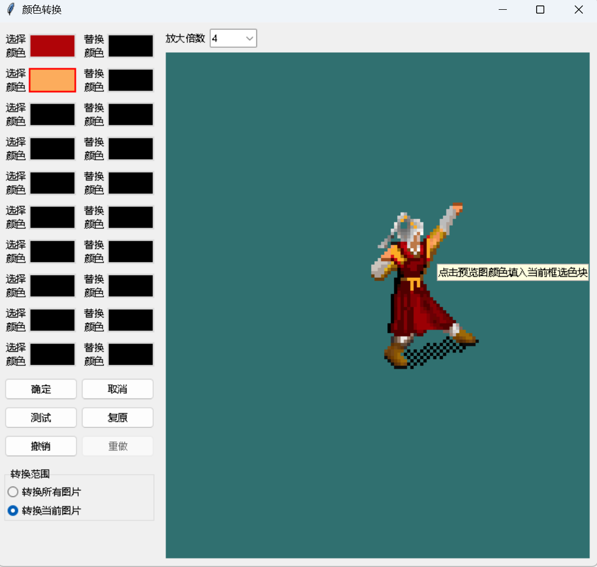
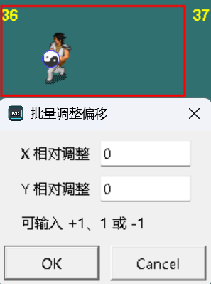
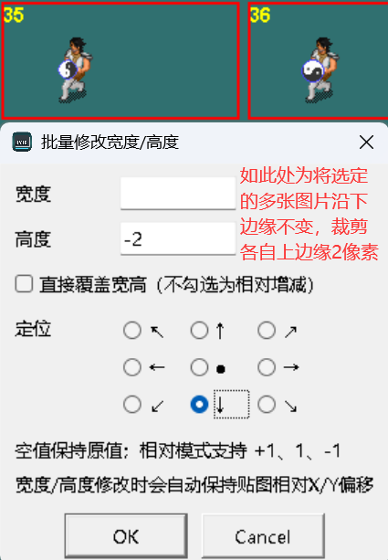
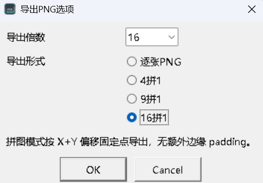
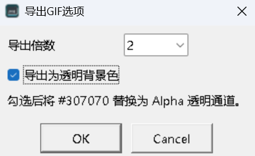
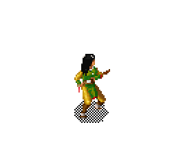
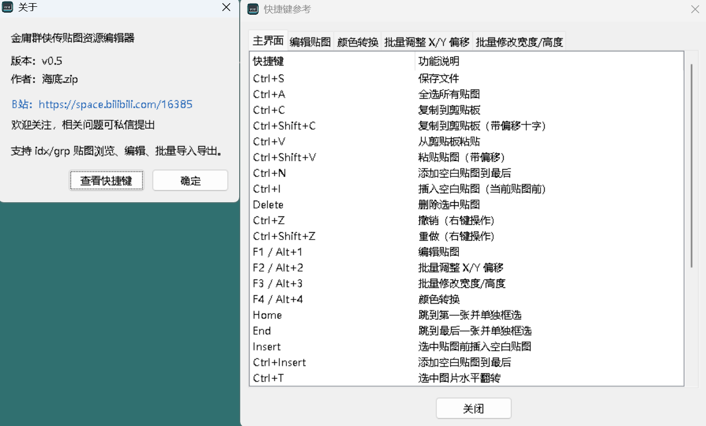

# 金庸群侠传贴图资源编辑器

金庸群侠传贴图资源编辑器是一个面向《金庸群侠传》及其改版资源格式的独立贴图查看、编辑与批量导入导出工具。它主要处理游戏常见的 `idx/grp`、`wdx/wmp`、`sdx/smp`、`fdx/fmp` 等贴图文件对，并保留每张贴图的宽度、高度、X 偏移、Y 偏移等游戏运行所需信息。

这个项目的起因很朴素：原修改器 sFishedit（SFE）能用，但批量导入导出、现代系统稳定性和贴图编辑效率都不太够用，尤其在 Win11 下改贴图时容易崩溃。因此我重新写了这个轻量编辑器，目标是让贴图维护、批量处理和逐帧校准更顺手。

[English README](README_EN.md)

## 0.5 更新重点

- 选中图片导出 PNG 支持**倍数缩放**（1/2/4/8/16 倍）和**拼合模式**（4拼1/9拼1/16拼1），导出携带 manifest 含格内偏移。导入自动从 manifest 或文件名还原。
- 新增**GIF 动画导出**：支持倍数缩放、透明背景色（#307070→Alpha）、文件名自动携带锚点 X/Y 偏移和 `_tr` 后缀。各帧独立保存避免帧合并丢失。
- 新增**GIF 动画导入**：从文件名自动检测倍数/偏移并缩回，Alpha→#307070 容差转换，duration 倍数自动展开重复帧。支持原样/自动裁剪边缘双模式。
- 导入双模式（原样 / 自动裁剪边缘）同时应用于 PNG 导入和 GIF 导入：原样保持边缘距离，自动裁剪切除透明边缘并校正 X/Y 偏移。
- 主界面键盘体系全面升级：数字 1-4 → F1~F4 + Alt+1~4；数字键改为连续索引导航（0.7s 超时）；新增 Home/End/Insert/Ctrl+T/Ctrl+R/Ctrl+G/Ctrl+Shift+G/Page Up/Page Down 等快捷键。
- 主窗口支持 Ctrl+Z / Ctrl+Shift+Z 撤销/重做右键操作，并显示在右键菜单中。
- 窗口宽高持久化到 config.ini，与单元宽度解耦。
- "关于"新增"查看快捷键"按钮，以标签页表格列出全部快捷键。
- 贴图编辑 Enter 确认宽高/偏移并支持撤销重做；当前颜色跨窗口记忆；裁剪选框不再弹出提示。
- 右键菜单重构：GIF 项归入文件操作组；插入空白贴图支持多选；复制/粘贴贴图支持复数张。

## 0.4 更新重点

- 贴图编辑新增"画笔/油漆桶"右键上色模式：画笔支持按住右键拖拽画 1 像素线，油漆桶会填充上下左右连续同色区域。
- 贴图编辑的当前颜色色块支持双击打开系统调色盘；贴图编辑和颜色转换的当前颜色都支持直接输入十六进制颜色，并自动映射到游戏调色盘最近色。
- 贴图编辑放大区域支持普通鼠标滚轮或 `Ctrl+鼠标滚轮` 切换上一张/下一张，`Alt+鼠标滚轮` 调整放大倍数。
- 主界面新增 `Delete`、方向键、`Shift+Home/End` 等快捷操作，方便删除、打开编辑/批量功能、移动和扩展红框选择。
- 主界面文件下拉框支持数字快速跳转 `fdxNNN/fmpNNN` 战斗贴图项，例如 `0`、`1`、快速输入 `12`、`117` 可分别跳到对应编号。
- "选中贴图导入PNG"拆成"带偏移"和"无偏移"：带偏移读取 `manifest.csv`，无偏移会忽略 `manifest.csv` 并优先保留被替换贴图原有 X/Y 偏移。
- 批量偏移弹窗不再默认填 `0`，打开后焦点在 X 输入框；批量宽高弹窗打开后焦点在宽度输入框，并支持方向键快速选择正上/正下/正左/正右锚点。
- 修正水平翻转后的 X 偏移计算，宽 38、X 偏移 25 翻转后为 13，再翻转可回到 25。
- 右键菜单在未载入文件或没有红框选择时，会置灰依赖选中贴图的操作，避免误点。

## 0.3 更新重点

- 主界面新增"单元宽度/单元高度"下拉框，可即时调整贴图网格单元和选中红框尺寸。
- `config.ini` 新增 `[View]` 配置段，`每行贴图`、单元宽高基准值和下拉范围均优先从配置读取，读不到时才使用内置预设。
- 贴图编辑和颜色转换窗口会在本次程序运行内记忆放大倍数；贴图编辑的"显示偏移""以X+Y偏移为固定点"也会在本次运行内记忆，重启程序后恢复默认。
- 所有下拉框支持 `Home`/`End` 快速选择第一项/最后一项，打开贴图编辑、颜色转换、关于等子窗口后会自动聚焦到新窗口。
- 右键菜单新增/完善水平翻转、复制并插入到最后、倒序复制并插入到最后、选中贴图向前/向后移位。
- "复制贴图(带偏移)"支持跨 JYIMGEditor 进程粘贴，保留宽高、像素和 X/Y 偏移，且只使用标准库实现。
- 修复原始贴图中 `#606060` 被误判为透明色的问题；原始 `idx/grp` 的透明只来自 RLE skip 或未编码区域。

## 界面预览

### 主界面



### 贴图编辑



### 颜色转换



### 批量调整X/Y偏移



### 批量修改宽度/高度



### 导出PNG选项



### 导出GIF选项



### GIF 动画演示（温青青·挥剑）

以下为自行修改的挥剑女角色（温青青）形象演示，以 2 倍尺寸 + 透明背景色导出：



> 该 GIF 可直接通过本软件的"从GIF动画导入"功能导回到对应 `fdx091/fmp091` 等 idx/grp 文件中，自动缩回原尺寸并还原透明色。文件名 `fmp091_x70_y89_s2_tr` 携带了锚点偏移 `(70, 89)`、2 倍缩放标记以及透明背景标记。

### 关于 · 查看快捷键

点击"关于"对话框中的"查看快捷键"按钮，可打开标签页式快捷键一览表：



## 功能概览

- 支持从 `config.ini` 扩展可查看的贴图文件列表，包括普通 `File0..FileN` 和 `FightName=fdx***,fmp***` 形式的战斗贴图序列。
- 浏览 `idx/grp` 图片，支持缩略图网格、滚动查看、多选、Shift 范围多选、右键菜单。
- 支持从 `config.ini` 的 `[View]` 段配置每行贴图数、单元宽度/高度基准值和各下拉菜单范围；界面修改后会写回当前选择值。
- 主窗口宽高持久化到 config.ini，与单元宽度解耦，重启恢复上次关闭时的窗口大小。
- 支持设置游戏 `data` 路径，并写回当前程序目录下的 `config.ini`。
- 支持单张贴图编辑：宽度、高度、X/Y 偏移、放大预览、1 倍预览、显示偏移红十字、上一张/下一张。
- 贴图编辑支持画笔和油漆桶两种右键上色模式；画笔可拖拽画线，油漆桶可填充连续同色区域。
- 贴图编辑支持双击当前颜色色块打开系统调色盘，也支持直接输入十六进制颜色并映射到最近调色盘色。
- 贴图编辑中按 Enter 确认宽高/偏移输入即生效，支持撤销/重做。当前颜色跨打开/关闭窗口记忆，重启重置。
- 贴图编辑和颜色转换窗口的放大倍数会在本次程序运行内记忆，重启后恢复默认 4 倍。
- 贴图编辑的"显示偏移"和"以X+Y偏移为固定点"勾选状态会在本次程序运行内记忆，不额外生成记录文件。
- 支持 X/Y 偏移负值，按 16 位有符号值读写；宽度、高度仍按无符号值处理。
- 支持左键拾取像素颜色，右键用当前颜色修改像素；当前颜色可设为透明色。
- 支持框选裁剪贴图，并同步调整宽高与 X/Y 偏移。
- 贴图编辑支持撤销、重做；主窗口支持 Ctrl+Z / Ctrl+Shift+Z 撤销/重做右键操作；无可用步骤时按钮/菜单自动置灰。
- 支持颜色转换窗口：多组"选择颜色/替换颜色"、十六进制颜色输入、右侧放大预览、测试、复原、撤销、重做，点击确定后才真正写入。
- 支持批量导出 PNG，并生成 `manifest.csv` 记录每张图的 `index/file/width/height/xoff/yoff`。
- 支持批量导入 PNG：覆盖全文件、追加到末尾、插入到当前选中贴图后。
- 支持对选中图片导出 PNG：可选择 1/2/4/8/16 倍放大，并支持 4拼1/9拼1/16拼1 拼合模式导出，附带 manifest 含格内偏移。
- 支持按文件名顺序把文件夹 PNG 导入到选中图片；可选读取 manifest 偏移，或忽略偏移保留被替换图原偏移。支持原样/自动裁剪边缘双模式。
- 支持多选删除贴图。
- 支持对多选图片批量调整相对 X/Y 偏移，例如 `+2`、`2`、`-2`。
- 支持对多选图片批量修改宽度/高度，可相对增减或直接覆盖，并可用九宫格定位裁边/扩边锚点。
- 支持对选中贴图水平翻转、原地倒序排列、复制并追加到末尾，以及整体向前/向后移位。
- 支持单图或多图从剪贴板粘贴、复制到剪贴板、复制/粘贴带 X/Y 偏移的贴图数据；带偏移复制写入系统剪贴板，可跨程序进程互粘。
- 支持选中贴图前插入空白贴图（多选时在首张前插入），以及添加空白贴图到最后。
- 支持选中图片导出 GIF 动画：可设倍数、透明背景色，文件名携带 X/Y 偏移和缩放标记。
- 支持从 GIF 动画导入到选中图片：自动识别倍数/偏移缩回，Alpha 转为 #307070，可按原样或自动裁剪边缘模式导入。
- 支持 `Ctrl+S` 保存，保存前确认，并为 idx/grp 自动生成 `.bak_时间戳` 备份。
- 切换文件前若当前贴图文件未保存，会提示是否保存；选择"否"才丢弃未保存进度。
- 打开子窗口后会主动聚焦到新窗口，便于直接使用键盘快捷键。
- 子窗口支持 `Esc` 关闭。
- "关于"对话框新增"查看快捷键"按钮，以标签页表格展示全部快捷键。
- `main.py` 开头提供 `UI_FONT_SIZE`、`UI_FONT_FAMILY`、`MAIN_WINDOW_EXTRA_WIDTH` 等参数，便于按本机显示效果微调字号和主窗口宽度。

## 作者主页

B站：https://space.bilibili.com/16385

欢迎关注，相关问题可私信提出。

## 相比 sFishedit/SFE 的新增重点

- 批量导出 PNG，并通过 `manifest.csv` 保留偏移信息。
- 批量导入 PNG，可覆盖、追加或插入。
- 选中图片导入/导出，以及多图宽高批量调整。
- 选中图片拼合导出（4拼1/9拼1/16拼1）和还原导入。
- GIF 动画导出（支持缩放、透明背景、偏移携带）和导入（自动倍数缩回、Alpha 转 #307070、帧展开）。
- 主界面可直接调整每行贴图数和单元宽高，默认值与可选范围可在 `config.ini` 中配置。窗口大小持久化并独立于单元宽度。
- 更适合大贴图库的懒解码与可见区域缩略图缓存，打开几千张图片的资源文件时不会一开始全量解码。
- 更完整的单图编辑体验：撤销/重做、透明色选择、右键改像素、框选裁剪、偏移红十字、1 倍/放大双预览，Enter 确认输入即时生效。
- 更灵活的颜色转换：多组映射、测试预览、复原、撤销/重做，最终确认后才写入。
- 多选批量偏移调整，方便逐帧动作或整组资源对齐。
- 更多多选整理操作：水平翻转、复制到末尾、原地倒序排列、前后移位、空白贴图插入。
- 更完整的键盘工作流：F1~F4 / Alt+1~4 打开功能窗口，数字键索引导航，方向键/Page Up/Page Down/Home/End/Insert 辅助浏览，Ctrl+T/R/G 等快捷操作。
- 更细的贴图编辑工具：画笔拖拽、油漆桶填充、十六进制颜色输入、双击系统调色盘。
- 跨进程复制/粘贴带偏移贴图，方便同时打开两个资源文件互相搬运帧（支持复数张）。
- 主窗口右键操作独立撤销/重做（Ctrl+Z / Ctrl+Shift+Z）。
- 原始贴图解码不再把最接近透明色的调色板索引当透明，避免误吞 `#606060` 等实际颜色。
- 在 Win11 环境下使用 Python/Tkinter 重写，避免旧工具在现代系统下频繁崩溃的问题。

## 快捷键

完整快捷键列表请打开程序 → "关于" → "查看快捷键"。

### 主界面

| 快捷键 | 功能 |
|--------|------|
| Enter | 加载/刷新当前贴图文件 |
| Ctrl+S | 保存文件 |
| Ctrl+A | 全选所有贴图 |
| Ctrl+C / Ctrl+V | 复制到/从剪贴板粘贴 |
| Ctrl+Shift+C / Ctrl+Shift+V | 复制/粘贴贴图（带偏移） |
| Ctrl+Z / Ctrl+Shift+Z | 撤销/重做（右键操作） |
| Ctrl+N | 添加空白贴图到最后 |
| Ctrl+I | 插入空白贴图（当前贴图前） |
| Ctrl+T | 选中图片水平翻转 |
| Ctrl+End | 选中图片复制并插入到最后 |
| Ctrl+R | 选中图片倒序排列 |
| Ctrl+G | 导出为 GIF 动画 |
| Ctrl+Shift+G | 从 GIF 动画导入 |
| Delete | 删除选中贴图 |
| F1 / Alt+1 | 编辑贴图 |
| F2 / Alt+2 | 批量调整 X/Y 偏移 |
| F3 / Alt+3 | 批量修改宽度/高度 |
| F4 / Alt+4 | 颜色转换 |
| Home / End | 跳到第一张/最后一张并单独框选 |
| Insert / Ctrl+Insert | 插入空白贴图前/添加到最后 |
| Page Up / Page Down | 向上/下翻一整页 |
| 0–9（连续按） | 按索引号跳转（0.7s 超时） |
| ↑ ↓ ← → | 方向键移动选择 |
| Shift+方向键 | 扩展选择范围 |
| Shift+Home / Shift+End | 选择到首/尾 |
| 鼠标滚轮 | 垂直滚动贴图列表 |

### 编辑贴图

| 快捷键 | 功能 |
|--------|------|
| Ctrl+Z / Ctrl+Shift+Z | 撤销/重做 |
| Ctrl+C / Ctrl+V | 复制到/从系统剪贴板粘贴 |
| Ctrl+E | 切换显示偏移十字 |
| Ctrl+Q | 切换以 X+Y 偏移为固定点 |
| Enter (输入框) | 确认宽高/偏移修改 |
| ← → | 上一张/下一张贴图 |
| Esc | 关闭编辑窗口 |
| 鼠标滚轮 | 切换上一张/下一张 |
| Ctrl+鼠标滚轮 | 切换上一张/下一张 |
| Alt+鼠标滚轮 | 调整放大倍数 |
| 左键点击画布 | 拾取颜色 |
| 右键拖拽画布 | 按画笔/油漆桶模式上色 |
| 左键拖拽画布 | 裁剪贴图到选框范围 |
| 双击色块 | 自定义选色 |

### 颜色转换

| 快捷键 | 功能 |
|--------|------|
| Ctrl+Z / Ctrl+Shift+Z | 撤销/重做 |
| 左键点击色块 | 选中当前行色块 |
| 双击色块 | 系统调色盘选色 |
| 左键预览图 | 拾取颜色 |
| Esc | 关闭窗口 |

## 使用方式

1. 运行程序。
2. 点击"设置data路径"，选择游戏目录下的 `data` 文件夹。
3. 选择要查看的贴图文件对，例如 `hdgrp.idx/hdgrp.grp`、`wdx/wmp`。
4. 点击"贴图查看"，或按 `Enter`。
5. 在主界面中双击或右键编辑贴图。
6. 修改后使用"保存"或 `Ctrl+S` 写回文件。保存会自动生成备份。

## 贴图格式说明

- `idx` 使用"每张图片结束 offset"格式。
- 第 0 张图片范围为 `0 -> idx[0]`，第 N 张图片范围为 `idx[N-1] -> idx[N]`。
- `grp` 单图结构：`宽/高/X偏移/Y偏移` 各 2 字节小端，后接逐行 RLE。
- 行 RLE 中段头为 `skip,count`，其中 `skip` 是相对上一段结束位置的透明像素跳过量。
- 原始 `idx/grp` 解码时，透明只来自 RLE skip 或未编码区域；不会把最接近 `#307070` 的调色板索引当作透明。
- 默认透明色为 `#307070`，导入 PNG 时精确匹配该颜色或带 alpha 透明的像素会被视为透明像素；GIF 导入时增加容差匹配以处理量化色偏。
- 调色板默认读取 `mmap.col`。

## 构建

需要 Python 3、Pillow 与 PyInstaller。Tkinter 通常随 Windows Python 一起安装。

在本目录运行：

```powershell
.\build_exe.ps1
```

若系统执行策略阻止脚本，可运行：

```powershell
powershell -ExecutionPolicy Bypass -File .\build_exe.ps1
```

输出文件在：

```text
dist\JYIMGEditor.exe
```

## 开源协议

本项目使用 Apache License 2.0 开源协议。
